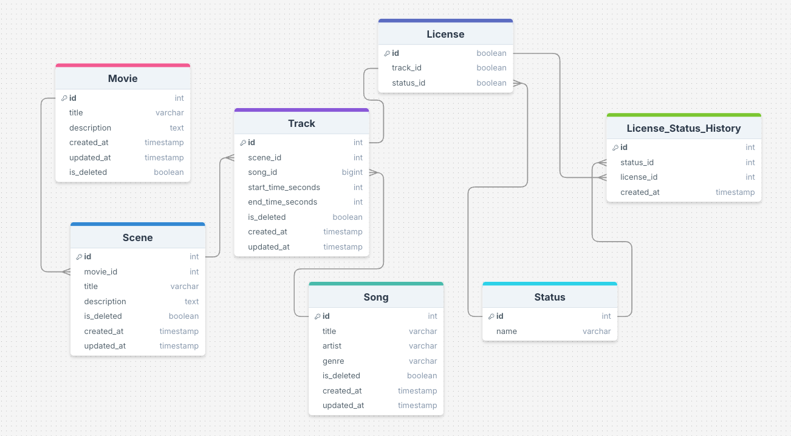
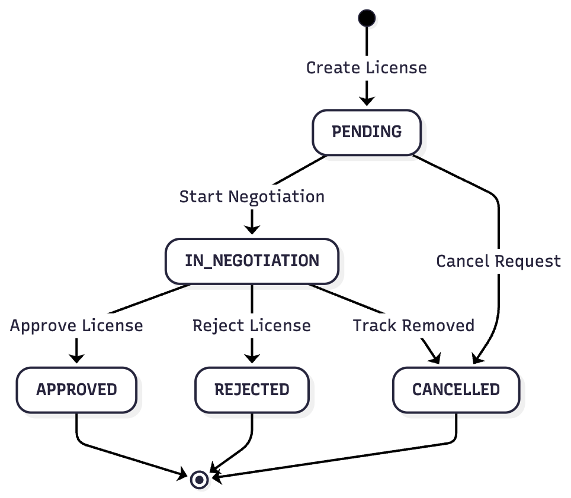

# 🎬 Music Licensing Workflow - Backend Documentation

## 📋 Overview

This is the backend API for the **Music Licensing Workflow** system, designed to help **ACME BROS PICTURES** manage the music licensing process for their movies. The system allows tracking of music tracks associated with movie scenes, managing licensing status through a stateful workflow, and providing real-time updates to clients.

## 🛠️ Tech Stack

- **Framework:** NestJS (TypeScript)
- **Database:** PostgreSQL
- **ORM:** TypeORM
- **API:** REST API
- **Real-time:** WebSockets (Socket.IO)
- **Caching:** Redis with multi-tier caching (in-memory + Redis)
- **Documentation:** Swagger/OpenAPI
- **Validation:** class-validator & class-transformer
- **Internationalization:** nestjs-i18n
- **Logging:** NestJS built-in Logger with HTTP interceptor
- **Containerization:** Docker

## 🏗️ Architecture

The backend follows a **modular architecture** using NestJS modules:

- **Movies Module:** Manages movie entities
- **Scenes Module:** Manages scene entities (belongs to movies)
- **Songs Module:** Manages song catalog
- **Tracks Module:** Manages tracks (associates songs to scenes with time ranges)
- **Licenses Module:** Manages licensing workflow and status transitions
- **WebSocket Module:** Handles real-time license status updates
- **Health Module:** Provides health check endpoints

### Key Features

- **Modular Design:** Each domain (movies, scenes, songs, tracks, licenses) is encapsulated in its own module
- **State Machine:** License status transitions follow a defined workflow
- **Real-time Updates:** WebSocket gateway broadcasts license status changes
- **Multi-tier Caching:** Redis-backed caching with in-memory fallback for improved performance
- **Pagination:** All list endpoints support pagination with comprehensive metadata
- **Search & Filtering:** Movies and Songs support search/filter capabilities
- **Soft Deletes:** Entities support soft deletion via `is_deleted` flag
- **Internationalization:** Error messages and validation messages support multiple languages (EN/ES)
- **API Documentation:** Swagger UI available at `/api/docs`

## 📊 Data Model

### Entity Relationships



### Core Entities

#### Movie

- `id`: Primary key
- `title`: Movie title
- `description`: Movie description
- `created_at`, `updated_at`: Timestamps
- `is_deleted`: Soft delete flag

#### Scene

- `id`: Primary key
- `movie_id`: Foreign key to Movie
- `title`: Scene title
- `description`: Scene description
- `created_at`, `updated_at`: Timestamps
- `is_deleted`: Soft delete flag

#### Song

- `id`: Primary key
- `title`: Song title
- `artist`: Artist name
- `genre`: Song genre
- `created_at`, `updated_at`: Timestamps
- `is_deleted`: Soft delete flag

#### Track

- `id`: Primary key
- `scene_id`: Foreign key to Scene
- `song_id`: Foreign key to Song
- `start_time_seconds`: Start time in seconds
- `end_time_seconds`: End time in seconds
- `created_at`, `updated_at`: Timestamps
- `is_deleted`: Soft delete flag

#### License

- `id`: Primary key
- `track_id`: Foreign key to Track (unique, one-to-one)
- `status_id`: Foreign key to Status
- Maintains a one-to-one relationship with Track

#### Status

- `id`: Primary key
- `name`: Status name (PENDING, IN_NEGOTIATION, APPROVED, REJECTED, CANCELLED)

#### LicenseStatusHistory

- Tracks all status changes for audit purposes
- `license_id`: Foreign key to License
- `status_id`: Foreign key to Status
- `created_at`: Timestamp of status change

## 🔄 License Workflow (State Machine)

The license management follows a state machine workflow that defines valid status transitions. When a track is created, a license is automatically created in the `PENDING` state.



### Workflow States

- **PENDING:** Initial state when a license is created for a track
- **IN_NEGOTIATION:** Active negotiation phase with rights holders
- **APPROVED:** Terminal state - license has been successfully approved
- **REJECTED:** Terminal state - license request has been rejected
- **CANCELLED:** Terminal state - license request has been cancelled

### Valid Transitions

1. **PENDING → IN_NEGOTIATION:** Triggered by "Start Negotiation"
2. **PENDING → CANCELLED:** Triggered by "Cancel Request"
3. **IN_NEGOTIATION → APPROVED:** Triggered by "Approve License"
4. **IN_NEGOTIATION → REJECTED:** Triggered by "Reject License"
5. **IN_NEGOTIATION → CANCELLED:** Triggered by "Track Removed"

### Implementation

The backend enforces these state transitions in the `LicensesService`. Invalid transitions will result in a validation error. All status changes are logged in the `LicenseStatusHistory` table for audit purposes, and real-time updates are broadcast via WebSocket to all connected clients.

## 🎯 Tech Decisions & Tradeoffs

### Why NestJS?

- **Modular Architecture:** NestJS's module system aligns perfectly with domain-driven design
- **TypeScript First:** Full type safety and excellent developer experience
- **Built-in Features:** Dependency injection, decorators, and extensive ecosystem
- **Scalability:** Easy to scale and maintain as the application grows

### Why REST API?

- **Simplicity:** REST is straightforward and well-understood
- **Stateless:** Each request contains all necessary information
- **Cacheable:** Responses can be cached for better performance
- **Standard HTTP Methods:** Clear semantics for CRUD operations
- **Swagger Integration:** Easy API documentation with NestJS Swagger

### Why PostgreSQL?

- **ACID Compliance:** Ensures data integrity for critical licensing workflows
- **Relational Data:** Perfect fit for the entity relationships (movies → scenes → tracks)
- **Mature Ecosystem:** Excellent tooling and TypeORM support
- **JSON Support:** Can store unstructured data if needed in the future

### Why WebSockets for Real-time?

- **Low Latency:** Immediate updates without polling overhead
- **Bidirectional:** Can extend to support client-to-server real-time features
- **Socket.IO:** Mature library with automatic reconnection and fallback support
- **Scalability:** Can be extended with Redis adapter for horizontal scaling

### Why Redis for Caching?

- **Performance:** Dramatically reduces database load and improves response times
- **Scalability:** Distributed caching enables horizontal scaling across multiple instances
- **Multi-tier Strategy:** In-memory fallback ensures caching works even if Redis is temporarily unavailable
- **Cache Invalidation:** Automatic cache invalidation on mutations ensures data consistency
- **Cost-effective:** Reduces database query costs and improves overall system efficiency

### Why TypeORM?

- **TypeScript Native:** Excellent TypeScript support with decorators
- **Active Record & Data Mapper:** Flexible patterns
- **Migration Support:** Built-in migration system
- **Relationships:** Easy definition of entity relationships

### Tradeoffs

1. **REST vs GraphQL:**
   - **Chosen:** REST for simplicity and standard HTTP semantics
   - **Tradeoff:** More endpoints needed, but clearer and easier to cache

2. **WebSocket vs Server-Sent Events:**
   - **Chosen:** WebSocket for bidirectional communication potential
   - **Tradeoff:** Slightly more complex, but more flexible for future features

3. **Soft Deletes:**
   - **Chosen:** Soft deletes to maintain data integrity and audit trail
   - **Tradeoff:** Requires filtering in queries, but preserves historical data

4. **Caching Strategy:**
   - **Chosen:** Multi-tier caching (Redis + in-memory) with write-through and invalidation
   - **Tradeoff:** Slightly more complex cache management, but significantly improved performance and reduced database load

5. **Pagination:**
   - **Chosen:** Offset-based pagination with comprehensive metadata
   - **Tradeoff:** Not as efficient as cursor-based pagination for very large datasets, but simpler to implement and understand

## 🔌 API Endpoints

All API endpoints are prefixed with `/api`. For example, to access the health endpoint, use `GET /api/health`.

### Health

- `GET /api/health` - Health check endpoint

### Movies

- `GET /api/movies` - Get all movies (with pagination and search)
  - Query parameters: `page` (default: 1), `limit` (default: 10), `search` (optional: search by title)
- `GET /api/movies/:id` - Get movie by ID
- `POST /api/movies` - Create a new movie
- `PUT /api/movies/:id` - Update a movie
- `DELETE /api/movies/:id` - Soft delete a movie

### Scenes

- `GET /api/scenes` - Get all scenes (with pagination)
- `GET /api/scenes/movie/:movieId` - Get all scenes for a movie (with pagination)
  - Query parameters: `page` (default: 1), `limit` (default: 10)
- `GET /api/scenes/:id` - Get scene by ID
- `POST /api/scenes` - Create a new scene
- `PUT /api/scenes/:id` - Update a scene
- `DELETE /api/scenes/:id` - Soft delete a scene

### Songs

- `GET /api/songs` - Get all songs (with pagination and filters)
  - Query parameters: `page` (default: 1), `limit` (default: 10), `title` (optional: filter by title), `artist` (optional: filter by artist)
- `GET /api/songs/:id` - Get song by ID
- `POST /api/songs` - Create a new song
- `PUT /api/songs/:id` - Update a song
- `DELETE /api/songs/:id` - Soft delete a song

### Tracks

- `POST /api/tracks` - Create a new track (associates a song to a scene)
- `GET /api/tracks/:id` - Get track by ID
- `GET /api/tracks/scene/:sceneId` - Get all tracks for a scene (with pagination)
  - Query parameters: `page` (default: 1), `limit` (default: 10)
- `GET /api/tracks/movie/:movieId` - Get all tracks for a movie (with pagination)
  - Query parameters: `page` (default: 1), `limit` (default: 10)
- `PUT /api/tracks/:id` - Update a track
- `PUT /api/tracks/:id/license/status` - Update license status of a track
- `DELETE /api/tracks/:id` - Soft delete a track

### Licenses

- `GET /api/licenses/:id` - Get license by ID
- `GET /api/licenses/:id/history` - Get license status history

## 🔄 Real-time Updates

The backend implements **WebSocket** support using Socket.IO for real-time license status updates.

### WebSocket Events

**Client → Server:**

- Connection: Clients connect to the WebSocket server
- Disconnection: Automatic handling

**Server → Client:**

- `licenseStatusUpdate`: Broadcasted when a license status changes
  ```json
  {
    "licenseId": 1,
    "statusId": 2,
    "statusName": "IN_NEGOTIATION",
    "trackId": 1,
    "timestamp": "2024-01-15T10:30:00Z"
  }
  ```

### Implementation

The `WebsocketGateway` is injected into the `LicensesService` and emits updates whenever a license status transition occurs. All connected clients receive these updates in real-time.

## ⚡ Caching

The backend implements a **multi-tier caching strategy** using Redis and in-memory caching to improve API response times and reduce database load.

### Caching Architecture

- **Primary Cache:** Redis for distributed caching across instances
- **Fallback Cache:** In-memory cache (LRU with 1000 item limit, 60s TTL) for fast local access
- **Cache Strategy:** Write-through caching with automatic invalidation on mutations

### Cached Endpoints

The following endpoints utilize caching:

- **Movies:** `GET /api/movies` - Cached by page, limit, and search query
- **Songs:** `GET /api/songs` - Cached by page, limit, title, and artist filters
- **Scenes:** `GET /api/scenes/movie/:movieId` - Cached by movie ID, page, and limit
- **Tracks:**
  - `GET /api/tracks/scene/:sceneId` - Cached by scene ID, page, and limit
  - `GET /api/tracks/movie/:movieId` - Cached by movie ID, page, and limit

### Cache Invalidation

Cache is automatically invalidated when:

- **Movies:** Created, updated, or deleted
- **Songs:** Created, updated, or deleted
- **Scenes:** Created, updated, or deleted
- **Tracks:** Created, updated, or deleted

Cache keys are structured hierarchically (e.g., `movies:page:1:limit:10:search:title`) to enable efficient partial invalidation.

### Cache Configuration

- **TTL:** 60 seconds (1 minute) for cached responses
- **Redis Connection:** Configured via `REDIS_URL` environment variable
- **In-memory Cache:** 1000 item LRU cache with 60s TTL

## 📄 Pagination

All list endpoints support **pagination** with comprehensive metadata to help clients navigate through large datasets.

### Pagination Parameters

- `page` (optional, default: 1): Page number (1-indexed)
- `limit` (optional, default: 10): Number of items per page

### Pagination Response Format

All paginated endpoints return responses in the following format:

```json
{
  "data": [...],
  "pagination": {
    "total": 100,
    "totalPages": 10,
    "pageSize": 10,
    "page": 1,
    "nextPage": 2,
    "previousPage": null,
    "hasNextPage": true,
    "hasPreviousPage": false
  }
}
```

### Pagination Metadata

- `total`: Total number of items across all pages
- `totalPages`: Total number of pages
- `pageSize`: Number of items per page (same as `limit`)
- `page`: Current page number
- `nextPage`: Next page number (null if on last page)
- `previousPage`: Previous page number (null if on first page)
- `hasNextPage`: Boolean indicating if there's a next page
- `hasPreviousPage`: Boolean indicating if there's a previous page

## 🚀 Setup Instructions

### Prerequisites

- Node.js 22.20.0 or higher
- Docker and Docker Compose
- PostgreSQL (if running locally without Docker)
- Redis (if running locally without Docker)

### Environment Variables

Create a `.env` file in the root directory with the following variables:

```env
# Database Configuration
DB_HOST=postgres
DB_PORT=5432
DB_USER=your_db_user
DB_PASSWORD=your_db_password
DB_NAME=your_db_name

# Application Configuration
PORT=3000
FALLBACK_LANGUAGE=en

# Redis Configuration
REDIS_URL=redis://redis:6379
```

> **Note:** When running with Docker Compose, Redis and Postgres are automatically configured. For local development, ensure Redis is running and update `REDIS_URL` accordingly.

### Running with Docker (Recommended)

1. **Build and start the services:**

   ```bash
   docker-compose up --build
   ```

2. **The application will:**
   - Start PostgreSQL database
   - Start Redis cache server
   - Run database migrations automatically
   - Run database seeding
   - Start the NestJS application on port 3000

3. **Access the API:**
   - API Base URL: `http://localhost:3000/api`
   - Swagger UI: `http://localhost:3000/api/docs`
   - WebSocket: `ws://localhost:3000`
   - Redis: `localhost:6379`

### Running Locally (Development)

1. **Install dependencies:**

   ```bash
   npm install
   ```

2. **Set up environment variables:**
   Create a `.env` file with the required variables (see above)

3. **Start PostgreSQL and Redis:**

   ```bash
   docker compose up -d postgres redis
   ```

4. **Run database migrations:**

   ```bash
   npm run db:migrate:run
   ```

5. **Seed the database (optional):**

   ```bash
   npm run db:seed
   ```

6. **Start the development server:**
   ```bash
   npm run start:dev
   ```

### Available Scripts

- `npm run build` - Build the application
- `npm run start` - Start the application
- `npm run start:dev` - Start in development mode with hot reload
- `npm run start:prod` - Start in production mode
- `npm run lint` - Run ESLint
- `npm run test` - Run unit tests
- `npm run test:e2e` - Run end-to-end tests
- `npm run db:migrate` - Create database migrations
- `npm run db:migrate:run` - Run database migrations
- `npm run db:seed` - Seed the database

## 🗄️ Database Migrations

The project uses TypeORM migrations for database schema management.

### Running Migrations

Migrations run automatically when the Docker container starts (via `entrypoint.sh`). For local development:

```bash
npm run db:migrate:run
```

### Migration Files

- `1763171378674-migration.ts` - Initial schema creation
- `1763222446416-migration.ts` - Additional schema updates

## 📁 Project Structure

```
src/
├── app.module.ts                 # Root application module
├── main.ts                       # Application entry point
├── common/                       # Shared utilities
│   ├── exceptions/              # Custom exception handlers
│   ├── filters/                 # Global exception filters
│   └── interceptors/            # HTTP interceptors (logging, etc.)
├── config/                       # Configuration modules
│   ├── app.config.ts            # App configuration
│   ├── i18n.config.ts           # Internationalization config
│   ├── swagger.config.ts        # Swagger/OpenAPI config
│   └── typeorm.config.ts         # TypeORM configuration
├── db/                           # Database related files
│   ├── datasource.ts            # TypeORM datasource
│   ├── migrations/              # Database migrations
│   └── seeders/                 # Database seeders
├── i18n/                         # Translation files
│   ├── en/                      # English translations
│   └── es/                      # Spanish translations
├── modules/                      # Feature modules
│   ├── health/                  # Health check module
│   ├── licenses/                # License management
│   ├── movies/                  # Movie management
│   ├── scenes/                  # Scene management
│   ├── songs/                   # Song catalog
│   ├── tracks/                  # Track management
│   └── websocket/               # WebSocket gateway
└── utils/                        # Utility functions
    ├── calculatePaginationResponse.ts
    └── getSkipPage.ts
```

## 📊 Logging

The application implements comprehensive logging using NestJS's built-in Logger, providing visibility into application behavior while maintaining clean, professional output.

### HTTP Request/Response Logging

All HTTP requests are automatically logged via the `HttpLoggingInterceptor`:

- **Request Logging:** Method, URL, IP address, User-Agent, query parameters, path parameters, and request body (with sensitive data redaction)
- **Response Logging:** Status code and response time
- **Log Levels:**
  - `log`: Successful requests (2xx, 3xx)
  - `warn`: Client errors (4xx)
  - `error`: Server errors (5xx)
- **Health Check Exclusion:** Health check endpoints (`/health`) are excluded to reduce log noise

### Service-Level Logging

Critical business operations are logged at the service level:

#### Movies Service

- Movie creation, updates, and soft deletions

#### Scenes Service

- Scene creation, updates, and soft deletions

#### Songs Service

- Song creation, updates, and soft deletions

#### Tracks Service

- Track creation and soft deletions

#### Licenses Service

- License creation
- License status transitions (with previous and new status)
- License removal (cancellation)

### WebSocket Logging

The WebSocket gateway logs:

- Client connections and disconnections
- License status update emissions

### Application Lifecycle Logging

- Application startup and configuration
- Database connection status
- Port and Swagger documentation URLs

### Error Logging

The global exception filter logs all errors with:

- Request method and URL
- Error message and stack trace
- Appropriate error context

### Security & Privacy

The logging interceptor automatically sanitizes sensitive data:

- Passwords, tokens, secrets, and authorization headers are redacted in logs
- Deep object traversal ensures nested sensitive fields are protected
- Logs maintain usability while protecting sensitive information

### Log Configuration

The application uses NestJS's built-in Logger with the following configuration:

- **Log Levels:** `error`, `warn`, `log` (configured in `main.ts`)
- **Format:** Structured logs with context (service name, log level, message)
- **Location:** Logs are output to console/stdout for container-friendly logging

## 🔒 Security Considerations

- **Input Validation:** All DTOs use `class-validator` decorators
- **SQL Injection:** TypeORM uses parameterized queries
- **Error Handling:** Global exception filter prevents sensitive error exposure
- **Soft Deletes:** Prevents accidental data loss
- **Sensitive Data Protection:** Logging interceptor automatically redacts passwords, tokens, and other sensitive fields

## 🧪 Testing

The project includes testing infrastructure:

- **Unit Tests:** Jest configuration for unit testing
- **E2E Tests:** End-to-end test setup in `test/` directory
- **Test Scripts:** `npm run test` and `npm run test:e2e`

## 📝 API Documentation

Interactive API documentation is available via Swagger UI:

- **URL:** `http://localhost:3000/api/docs`

## 🌐 Internationalization

The backend supports multiple languages for error messages and validation:

- **Supported Languages:** English (en), Spanish (es)
- **Configuration:** Set via `FALLBACK_LANGUAGE` environment variable
- **Usage:** Language can be specified via query parameter `?lang=en` or `Accept-Language` header
